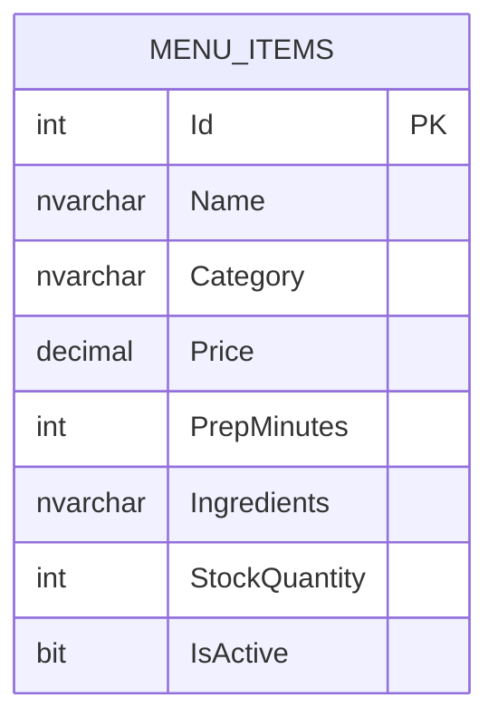

# Database Diagram

## Database Name

`RestaurantOrderKitchenTrackingSystemDb`

The project uses SQL Server LocalDB and ADO.NET. The application creates the database and table automatically at startup through `DatabaseService.Initialize()`.

## ER Diagram



## Table Description

### MenuItems

The `MenuItems` table is the main database entity used to satisfy the ADO.NET CRUD requirement.

| Column | Type | Key | Nullable | Description |
|---|---:|---|---|---|
| `Id` | `INT` | Primary Key | No | Unique menu item identifier. |
| `Name` | `NVARCHAR(100)` |  | No | Display name of the food or drink item. |
| `Category` | `NVARCHAR(60)` |  | No | Menu category such as Drinks, Main Courses, Desserts, or Salads. |
| `Price` | `DECIMAL(18,2)` |  | No | Sales price of the item. |
| `PrepMinutes` | `INT` |  | No | Estimated preparation time in minutes. |
| `Ingredients` | `NVARCHAR(MAX)` |  | No | Comma-separated ingredient list used for customization. |
| `StockQuantity` | `INT` |  | No | Current stock quantity for the item. |
| `IsActive` | `BIT` |  | No | Indicates whether the item is available for sale. |

## CRUD Mapping

| CRUD Operation | Application Action | ADO.NET Method | SQL Operation |
|---|---|---|---|
| Create | `Add Menu` | `DatabaseService.InsertMenuItem()` | `INSERT INTO dbo.MenuItems` |
| Read | Application startup / menu refresh | `DatabaseService.GetMenuItems()` | `SELECT ... FROM dbo.MenuItems` |
| Update | `Restock`, `Toggle Item`, order stock decrease | `DatabaseService.UpdateMenuItem()` | `UPDATE dbo.MenuItems` |
| Delete | `Delete Item` | `DatabaseService.DeleteMenuItem()` | `DELETE FROM dbo.MenuItems` |

## Relationships

The submitted database contains one required CRUD entity, `MenuItems`. Runtime order, payment, and table workflow data are represented in application model classes and local application state. The `RestaurantOrder` model references `MenuItem` objects in memory through `OrderLine`. This keeps the database requirement focused on the required CRUD entity while the desktop application still demonstrates a complete restaurant workflow.

## Triggers

No database triggers are used. Stock changes are handled in the application layer:

- When an order is submitted, item stock is decreased and `MenuItems` is updated through ADO.NET.
- When an order is cancelled, item stock is restored and `MenuItems` is updated through ADO.NET.

## SQL Table Creation

```sql
CREATE TABLE dbo.MenuItems
(
    Id INT NOT NULL PRIMARY KEY,
    Name NVARCHAR(100) NOT NULL,
    Category NVARCHAR(60) NOT NULL,
    Price DECIMAL(18,2) NOT NULL,
    PrepMinutes INT NOT NULL,
    Ingredients NVARCHAR(MAX) NOT NULL,
    StockQuantity INT NOT NULL,
    IsActive BIT NOT NULL
);
```
