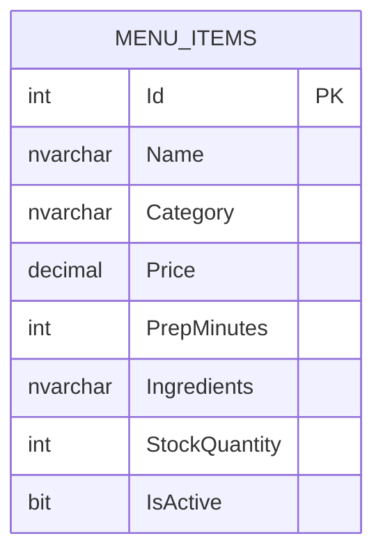
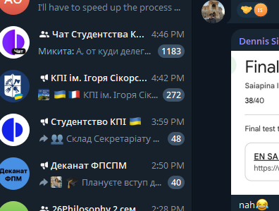
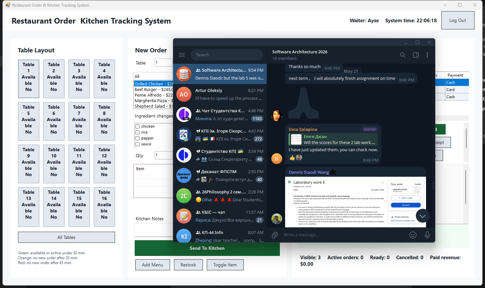

# Software Report: Restaurant Order & Kitchen Tracking System

## Project Information

- **Project name:** Restaurant Order & Kitchen Tracking System
- **Application type:** Windows Forms desktop application
- **Framework:** Microsoft .NET Framework 4.8
- **Database technology:** SQL Server LocalDB with ADO.NET
- **Repository:** https://github.com/emrhangcl/RestaurantOrderKitchenTrackingSystem

This report is prepared according to the requested structure: three main sections and one appendix. The first section explains the classes created in the project. The second section explains the database schema, tables, relationships, and diagram. The third section describes the user interface and developed functionality. The appendix contains the complete code listing.

---

# Section 1: Classes, Fields, Methods, And Functionality

## 1.1 Program

**File:** `Program.cs`

The `Program` class is the entry point of the application.

**Main functionality:**

- Enables Windows Forms visual styles.
- Opens the login form.
- Starts the main application form after successful authentication.
- Supports logout by returning to the login screen.

**Important method:**

- `Main()` starts the application loop and controls login/logout behavior.

## 1.2 LoginForm

**File:** `LoginForm.cs`

The `LoginForm` class provides the user authentication screen.

**Main fields:**

- `_waiters`: stores demo user accounts and their roles.
- `_usernameBox`: input for username.
- `_passwordBox`: input for password.
- `_messageLabel`: displays login information or errors.

**Important methods:**

- `BuildInterface()` creates the login UI.
- `TryLogin()` validates username and password.
- `PasswordBoxKeyDown()` allows login with the Enter key.

**Functionality:**

The form supports role-based login for Waiter, Kitchen, Cashier, and Manager users.

## 1.3 MainForm

**File:** `MainForm.cs`

The `MainForm` class is the main user interface of the restaurant management system.

**Main fields:**

- `_loggedInWaiter`: stores the currently logged-in account.
- `_menuItems`: stores menu items loaded from the database.
- `_orders`: stores active and paid restaurant orders.
- `_currentLines`: stores the current cart before order submission.
- `_tables`: stores table state information.
- `_clockTimer`: updates system time, order timing, and table colors.
- `_selectedTableNumber`: stores the currently selected table.
- `_ordersGrid`: displays kitchen/order tracking records.
- `_receiptBox`: displays receipt preview.
- `_salesSummaryLabel`: displays daily cash, card, and total revenue.

**Important methods:**

- `BuildInterface()` creates the main layout.
- `BuildTablePanel()` creates the 16-table restaurant layout.
- `BuildOrderPanel()` creates order-entry controls.
- `BuildKitchenPanel()` creates kitchen tracking, payment, report, and management controls.
- `LoadOrSeedData()` initializes the database and default application data.
- `RefreshMenu()` reads and displays menu items.
- `AddSelectedItem()` adds selected menu items to the cart.
- `SubmitOrder()` creates a restaurant order and decreases stock.
- `ChangeSelectedStatus()` updates kitchen/payment status.
- `SplitPaySelectedOrder()` supports split cash/card payments.
- `ShowDayReport()` displays end-of-day reporting.
- `TransferSelectedOrder()` transfers an order to another table.
- `MergeSelectedTable()` moves all active orders from one table to another.
- `SetSelectedTableState()` marks a table as Available, Reserved, or Cleaning.
- `AddMenuItem()`, `RestockSelectedMenuItem()`, `ToggleSelectedMenuItem()`, and `DeleteSelectedMenuItem()` implement menu CRUD operations.
- `SaveState()` persists runtime application state.

**Functionality:**

This class coordinates the entire restaurant workflow: table selection, order entry, kitchen preparation, payment, reporting, receipt export, role authorization, and menu management.

## 1.4 Models And Enums

**File:** `Models.cs`

This file contains the data models and enums used by the application.

### Enums

- `OrderStatus`: New, Preparing, Ready, Served, Paid, Cancelled.
- `PaymentMethod`: None, Cash, Card, Split.
- `UserRole`: Waiter, Kitchen, Cashier, Manager.
- `TableState`: Available, Reserved, Cleaning.

### MenuItem

Represents a menu item stored in the SQL database.

**Fields/properties:**

- `Id`
- `Name`
- `Category`
- `Price`
- `PrepMinutes`
- `Ingredients`
- `StockQuantity`
- `IsActive`

**Important method:**

- `ToString()` displays item name, price, and stock status in the UI.

### OrderLine

Represents one item in an order.

**Fields/properties:**

- `Item`
- `Quantity`
- `Customization`
- `Total`
- `PrepMinutes`
- `DisplayName`

### PaymentRecord

Represents a payment transaction.

**Fields/properties:**

- `Method`
- `Amount`
- `PaidAt`

### RestaurantOrder

Represents a full restaurant order.

**Fields/properties:**

- `Id`
- `TableNumber`
- `ServerName`
- `Notes`
- `CreatedAt`
- `LastActivityAt`
- `Status`
- `PaymentMethod`
- `Lines`
- `Payments`
- `Total`
- `PaidAmount`
- `Balance`
- `EstimatedPrepMinutes`
- `ItemsSummary`
- `ReceiptText`

### WaiterAccount

Represents a login account.

**Fields/properties:**

- `Username`
- `Password`
- `DisplayName`
- `Role`

### RestaurantTable

Represents table status and timing.

**Fields/properties:**

- `Number`
- `LastOrderAt`
- `HasActiveOrder`
- `State`
- `MinutesSinceLastOrder`

### AppState

Represents serialized runtime state.

**Fields/properties:**

- `MenuItems`
- `Orders`
- `Tables`
- `NextOrderId`

## 1.5 DatabaseService

**File:** `DatabaseService.cs`

This class implements ADO.NET database operations.

**Main fields/constants:**

- `DatabaseName`
- `MasterConnectionString`
- `AppConnectionString`

**Important methods:**

- `Initialize()`: creates the LocalDB database and `MenuItems` table if they do not exist.
- `GetMenuItems()`: reads menu records from SQL Server.
- `InsertMenuItem()`: inserts a new menu item.
- `UpdateMenuItem()`: updates an existing menu item.
- `DeleteMenuItem()`: deletes a menu item.
- `ExecuteMenuItemCommand()`: shared helper for parameterized insert/update operations.

**Functionality:**

This class satisfies the ADO.NET CRUD requirement using `SqlConnection`, `SqlCommand`, and `SqlDataReader`.

## 1.6 DataStore

**File:** `DataStore.cs`

This class serializes runtime state and exports receipts.

**Important methods:**

- `Load()`: loads saved application state.
- `Save()`: saves application state.
- `SaveReceipt()`: writes selected order receipt text to a file.

## 1.7 PaymentMethodForm

**File:** `PaymentMethodForm.cs`

This form provides an in-application payment method selection screen.

**Functionality:**

- Displays selected order number, table number, and total.
- Provides two large buttons: Cash and Card.
- Returns the selected payment method to `MainForm`.

## 1.8 PromptDialog

**File:** `PromptDialog.cs`

This helper class displays small input dialogs.

**Important method:**

- `Ask()` opens a modal text input dialog and returns the entered value.

## 1.9 AssemblyInfo

**File:** `Properties/AssemblyInfo.cs`

This file contains assembly metadata such as title, description, product name, GUID, and version.

---

# Section 2: Database Schema, Diagram, Tables, Relationships, And Triggers

## 2.1 Database Overview

The application uses SQL Server LocalDB with ADO.NET.

- **Database name:** `RestaurantOrderKitchenTrackingSystemDb`
- **Main CRUD table:** `MenuItems`
- **Database access class:** `DatabaseService`
- **Connection provider:** `System.Data.SqlClient`

The database and table are created automatically when the application starts.

## 2.2 Database Diagram



## 2.3 MenuItems Table

| Column | Type | Key | Nullable | Description |
|---|---:|---|---|---|
| `Id` | `INT` | Primary Key | No | Unique menu item identifier. |
| `Name` | `NVARCHAR(100)` |  | No | Name of the menu item. |
| `Category` | `NVARCHAR(60)` |  | No | Menu category. |
| `Price` | `DECIMAL(18,2)` |  | No | Item price. |
| `PrepMinutes` | `INT` |  | No | Estimated preparation time. |
| `Ingredients` | `NVARCHAR(MAX)` |  | No | Comma-separated ingredient list. |
| `StockQuantity` | `INT` |  | No | Available stock count. |
| `IsActive` | `BIT` |  | No | Availability flag. |

## 2.4 SQL Creation Script

```sql
CREATE TABLE dbo.MenuItems
(
    Id INT NOT NULL PRIMARY KEY,
    Name NVARCHAR(100) NOT NULL,
    Category NVARCHAR(60) NOT NULL,
    Price DECIMAL(18,2) NOT NULL,
    PrepMinutes INT NOT NULL,
    Ingredients NVARCHAR(MAX) NOT NULL,
    StockQuantity INT NOT NULL,
    IsActive BIT NOT NULL
);
```

## 2.5 CRUD Mapping

| CRUD Operation | User Interface Action | ADO.NET Method | SQL Operation |
|---|---|---|---|
| Create | Add Menu | `InsertMenuItem()` | `INSERT` |
| Read | Application startup / menu list | `GetMenuItems()` | `SELECT` |
| Update | Restock / Toggle Item / Stock update | `UpdateMenuItem()` | `UPDATE` |
| Delete | Delete Item | `DeleteMenuItem()` | `DELETE` |

## 2.6 Relationships

The submitted database contains one main required entity, `MenuItems`. The assignment requires CRUD operations for at least one database entity, and `MenuItems` satisfies this requirement.

Order, payment, and table workflow information is represented by application model classes and local state. In the application model, `RestaurantOrder` contains `OrderLine` objects, and each `OrderLine` references a `MenuItem`. This creates a logical application-level relationship between orders and menu records.

## 2.7 Triggers

No database triggers are used. Business rules are handled in the application layer:

- Submitting an order decreases item stock.
- Cancelling an order restores item stock.
- Both operations update the `MenuItems` table through ADO.NET.

---

# Section 3: User Interface And Developed Functionality

## 3.1 Login Screen

The first screen is the login form. It supports role-based login with username and password.

Demo accounts:

| Username | Password | Role |
|---|---|---|
| `ayse` | `1234` | Waiter |
| `mehmet` | `1234` | Waiter |
| `chef` | `1234` | Kitchen |
| `cashier` | `1234` | Cashier |
| `manager` | `1234` | Manager |



## 3.2 Main Form Layout

The main form contains three main areas:

1. Table layout panel
2. Order entry panel
3. Kitchen tracking and payment panel



## 3.3 Table Layout

The table layout displays 16 restaurant tables. Clicking a table filters the right-side tracking panel to that table's active orders.

Table colors:

- Green: active under 30 minutes
- Orange: active without a new order after 30 minutes
- Red: active without a new order after 45 minutes
- Gray: no active order
- Blue: reserved
- Light gray: cleaning

## 3.4 Order Entry

The order panel allows the user to:

- Select a table.
- Select menu category.
- Select menu item.
- Remove ingredients.
- Add extra ingredient notes.
- Select quantity.
- Add items to cart.
- Send the order to the kitchen.

When an order is submitted, item stock is decreased and the `MenuItems` table is updated through ADO.NET.

## 3.5 Kitchen Tracking

The kitchen tracking panel displays orders and status values:

- New
- Preparing
- Ready
- Served
- Paid
- Cancelled

Kitchen users can update preparation statuses. The table can also be filtered by status.

## 3.6 Payment

The payment workflow supports:

- Cash payment
- Card payment
- Split payment

When `Paid` is selected, an in-application payment screen opens with large Cash and Card buttons. Paid orders are removed from the active table view and included in daily sales totals.

## 3.7 Daily Sales And Report

The system displays:

- Cash total
- Card total
- Grand total
- Paid order count
- Cancelled order count
- Best-selling item
- Waiter performance

## 3.8 Menu Management

Manager users can manage the `MenuItems` database entity:

- Add Menu: creates a new database record.
- Restock: updates stock quantity.
- Toggle Item: updates active/passive status.
- Delete Item: deletes a database record.

These actions demonstrate full CRUD functionality.

## 3.9 Receipt Export

The selected order can be exported as a text receipt. The receipt includes table number, server, items, payment details, total, and balance.

## 3.10 Table Operations

The application supports:

- Transfer order to another table
- Merge active orders from one table to another
- Mark table as Available
- Mark table as Reserved
- Mark table as Cleaning

---

# Appendix: Complete Code Listing

The following appendix contains the complete source code listing for the project.


## Program.cs

```csharp
using System;
using System.Windows.Forms;

namespace RestaurantOrderKitchenTrackingSystem
{
    internal static class Program
    {
        [STAThread]
        private static void Main()
        {
            Application.EnableVisualStyles();
            Application.SetCompatibleTextRenderingDefault(false);

            while (true)
            {
                using (var loginForm = new LoginForm())
                {
                    if (loginForm.ShowDialog() != DialogResult.OK)
                    {
                        return;
                    }

                    using (var mainForm = new MainForm(loginForm.LoggedInWaiter))
                    {
                        Application.Run(mainForm);
                        if (!mainForm.IsLoggingOut)
                        {
                            return;
                        }
                    }
                }
            }
        }
    }
}

```

## Models.cs

```csharp
using System;
using System.Collections.Generic;
using System.Linq;

namespace RestaurantOrderKitchenTrackingSystem
{
    [Serializable]
    public enum OrderStatus
    {
        New,
        Preparing,
        Ready,
        Served,
        Paid,
        Cancelled
    }

    [Serializable]
    public enum PaymentMethod
    {
        None,
        Cash,
        Card,
        Split
    }

    [Serializable]
    public enum UserRole
    {
        Waiter,
        Kitchen,
        Cashier,
        Manager
    }

    [Serializable]
    public enum TableState
    {
        Available,
        Reserved,
        Cleaning
    }

    [Serializable]
    public sealed class MenuItem
    {
        public MenuItem(int id, string name, string category, decimal price, int prepMinutes, IEnumerable<string> ingredients, int stockQuantity)
        {
            Id = id;
            Name = name;
            Category = category;
            Price = price;
            PrepMinutes = prepMinutes;
            Ingredients = ingredients.ToList();
            StockQuantity = stockQuantity;
            IsActive = true;
        }

        public int Id { get; }
        public string Name { get; set; }
        public string Category { get; set; }
        public decimal Price { get; set; }
        public int PrepMinutes { get; set; }
        public List<string> Ingredients { get; }
        public int StockQuantity { get; set; }
        public bool IsActive { get; set; }

        public override string ToString()
        {
            var status = IsActive ? "Stock: " + StockQuantity : "Unavailable";
            return Name + " - " + Price.ToString("C") + " (" + status + ")";
        }
    }

    [Serializable]
    public sealed class OrderLine
    {
        public OrderLine(MenuItem item, int quantity, string customization)
        {
            Item = item;
            Quantity = quantity;
            Customization = customization;
        }

        public MenuItem Item { get; }
        public int Quantity { get; set; }
        public string Customization { get; set; }
        public decimal Total => Item.Price * Quantity;
        public int PrepMinutes => Item.PrepMinutes * Quantity;

        public string DisplayName
        {
            get
            {
                return string.IsNullOrWhiteSpace(Customization)
                    ? Item.Name
                    : Item.Name + " (" + Customization + ")";
            }
        }
    }

    [Serializable]
    public sealed class PaymentRecord
    {
        public PaymentRecord(PaymentMethod method, decimal amount)
        {
            Method = method;
            Amount = amount;
            PaidAt = DateTime.Now;
        }

        public PaymentMethod Method { get; }
        public decimal Amount { get; }
        public DateTime PaidAt { get; }
    }

    [Serializable]
    public sealed class RestaurantOrder
    {
        public RestaurantOrder(int id, int tableNumber, string serverName, string notes, IEnumerable<OrderLine> lines)
        {
            Id = id;
            TableNumber = tableNumber;
            ServerName = serverName;
            Notes = notes;
            Lines = lines.ToList();
            Payments = new List<PaymentRecord>();
            CreatedAt = DateTime.Now;
            LastActivityAt = CreatedAt;
            Status = OrderStatus.New;
            PaymentMethod = PaymentMethod.None;
        }

        public int Id { get; }
        public int TableNumber { get; set; }
        public string ServerName { get; }
        public string Notes { get; }
        public DateTime CreatedAt { get; }
        public DateTime LastActivityAt { get; set; }
        public OrderStatus Status { get; set; }
        public PaymentMethod PaymentMethod { get; set; }
        public List<OrderLine> Lines { get; }
        public List<PaymentRecord> Payments { get; }
        public decimal Total => Lines.Sum(line => line.Total);
        public decimal PaidAmount => Payments.Sum(payment => payment.Amount);
        public decimal Balance => Total - PaidAmount;
        public int EstimatedPrepMinutes => Lines.Sum(line => line.PrepMinutes);
        public string ItemsSummary => string.Join(", ", Lines.Select(line => line.Quantity + "x " + line.DisplayName));

        public string ReceiptText
        {
            get
            {
                var receiptLines = Lines.Select(line => line.Quantity + " x " + line.DisplayName + " = " + line.Total.ToString("C"));
                var paymentLines = Payments.Count == 0
                    ? "-"
                    : string.Join(Environment.NewLine, Payments.Select(payment => payment.Method + ": " + payment.Amount.ToString("C")));

                return "Order #" + Id + Environment.NewLine
                    + "Table: " + TableNumber + Environment.NewLine
                    + "Server: " + ServerName + Environment.NewLine
                    + "Status: " + Status + Environment.NewLine
                    + "Payment: " + PaymentMethod + Environment.NewLine
                    + "Created: " + CreatedAt.ToString("g") + Environment.NewLine
                    + "Elapsed: " + Math.Floor((DateTime.Now - CreatedAt).TotalMinutes) + " min" + Environment.NewLine
                    + "Notes: " + (string.IsNullOrWhiteSpace(Notes) ? "-" : Notes) + Environment.NewLine
                    + Environment.NewLine
                    + string.Join(Environment.NewLine, receiptLines) + Environment.NewLine
                    + Environment.NewLine
                    + "Payments:" + Environment.NewLine
                    + paymentLines + Environment.NewLine
                    + Environment.NewLine
                    + "Total: " + Total.ToString("C") + Environment.NewLine
                    + "Balance: " + Math.Max(0, Balance).ToString("C");
            }
        }
    }

    [Serializable]
    public sealed class WaiterAccount
    {
        public WaiterAccount(string username, string password, string displayName, UserRole role)
        {
            Username = username;
            Password = password;
            DisplayName = displayName;
            Role = role;
        }

        public string Username { get; }
        public string Password { get; }
        public string DisplayName { get; }
        public UserRole Role { get; }
    }

    [Serializable]
    public sealed class RestaurantTable
    {
        public RestaurantTable(int number)
        {
            Number = number;
            State = TableState.Available;
        }

        public int Number { get; }
        public DateTime? LastOrderAt { get; set; }
        public bool HasActiveOrder { get; set; }
        public TableState State { get; set; }

        public int MinutesSinceLastOrder
        {
            get
            {
                if (LastOrderAt == null)
                {
                    return 0;
                }

                return (int)Math.Floor((DateTime.Now - LastOrderAt.Value).TotalMinutes);
            }
        }
    }

    [Serializable]
    public sealed class AppState
    {
        public List<MenuItem> MenuItems { get; set; }
        public List<RestaurantOrder> Orders { get; set; }
        public List<RestaurantTable> Tables { get; set; }
        public int NextOrderId { get; set; }
    }
}

```

## DatabaseService.cs

```csharp
using System.Collections.Generic;
using System.Data.SqlClient;
using System.Linq;

namespace RestaurantOrderKitchenTrackingSystem
{
    public static class DatabaseService
    {
        private const string DatabaseName = "RestaurantOrderKitchenTrackingSystemDb";
        private const string MasterConnectionString = @"Data Source=(localdb)\MSSQLLocalDB;Initial Catalog=master;Integrated Security=True";
        private const string AppConnectionString = @"Data Source=(localdb)\MSSQLLocalDB;Initial Catalog=RestaurantOrderKitchenTrackingSystemDb;Integrated Security=True";

        public static void Initialize()
        {
            using (var connection = new SqlConnection(MasterConnectionString))
            {
                connection.Open();
                using (var command = new SqlCommand("IF DB_ID(@name) IS NULL CREATE DATABASE [" + DatabaseName + "]", connection))
                {
                    command.Parameters.AddWithValue("@name", DatabaseName);
                    command.ExecuteNonQuery();
                }
            }

            using (var connection = new SqlConnection(AppConnectionString))
            {
                connection.Open();
                var sql = @"
IF OBJECT_ID('dbo.MenuItems', 'U') IS NULL
BEGIN
    CREATE TABLE dbo.MenuItems
    (
        Id INT NOT NULL PRIMARY KEY,
        Name NVARCHAR(100) NOT NULL,
        Category NVARCHAR(60) NOT NULL,
        Price DECIMAL(18,2) NOT NULL,
        PrepMinutes INT NOT NULL,
        Ingredients NVARCHAR(MAX) NOT NULL,
        StockQuantity INT NOT NULL,
        IsActive BIT NOT NULL
    )
END";
                using (var command = new SqlCommand(sql, connection))
                {
                    command.ExecuteNonQuery();
                }
            }
        }

        public static List<MenuItem> GetMenuItems()
        {
            var items = new List<MenuItem>();
            using (var connection = new SqlConnection(AppConnectionString))
            using (var command = new SqlCommand("SELECT Id, Name, Category, Price, PrepMinutes, Ingredients, StockQuantity, IsActive FROM dbo.MenuItems ORDER BY Id", connection))
            {
                connection.Open();
                using (var reader = command.ExecuteReader())
                {
                    while (reader.Read())
                    {
                        var item = new MenuItem(
                            reader.GetInt32(0),
                            reader.GetString(1),
                            reader.GetString(2),
                            reader.GetDecimal(3),
                            reader.GetInt32(4),
                            reader.GetString(5).Split(',').Select(part => part.Trim()),
                            reader.GetInt32(6));
                        item.IsActive = reader.GetBoolean(7);
                        items.Add(item);
                    }
                }
            }

            return items;
        }

        public static void InsertMenuItem(MenuItem item)
        {
            const string sql = @"INSERT INTO dbo.MenuItems (Id, Name, Category, Price, PrepMinutes, Ingredients, StockQuantity, IsActive)
VALUES (@Id, @Name, @Category, @Price, @PrepMinutes, @Ingredients, @StockQuantity, @IsActive)";
            ExecuteMenuItemCommand(sql, item);
        }

        public static void UpdateMenuItem(MenuItem item)
        {
            const string sql = @"UPDATE dbo.MenuItems
SET Name = @Name,
    Category = @Category,
    Price = @Price,
    PrepMinutes = @PrepMinutes,
    Ingredients = @Ingredients,
    StockQuantity = @StockQuantity,
    IsActive = @IsActive
WHERE Id = @Id";
            ExecuteMenuItemCommand(sql, item);
        }

        public static void DeleteMenuItem(int id)
        {
            using (var connection = new SqlConnection(AppConnectionString))
            using (var command = new SqlCommand("DELETE FROM dbo.MenuItems WHERE Id = @Id", connection))
            {
                command.Parameters.AddWithValue("@Id", id);
                connection.Open();
                command.ExecuteNonQuery();
            }
        }

        private static void ExecuteMenuItemCommand(string sql, MenuItem item)
        {
            using (var connection = new SqlConnection(AppConnectionString))
            using (var command = new SqlCommand(sql, connection))
            {
                command.Parameters.AddWithValue("@Id", item.Id);
                command.Parameters.AddWithValue("@Name", item.Name);
                command.Parameters.AddWithValue("@Category", item.Category);
                command.Parameters.AddWithValue("@Price", item.Price);
                command.Parameters.AddWithValue("@PrepMinutes", item.PrepMinutes);
                command.Parameters.AddWithValue("@Ingredients", string.Join(", ", item.Ingredients));
                command.Parameters.AddWithValue("@StockQuantity", item.StockQuantity);
                command.Parameters.AddWithValue("@IsActive", item.IsActive);
                connection.Open();
                command.ExecuteNonQuery();
            }
        }
    }
}

```

## DataStore.cs

```csharp
using System;
using System.IO;
using System.Runtime.Serialization.Formatters.Binary;

namespace RestaurantOrderKitchenTrackingSystem
{
    public static class DataStore
    {
        private static readonly string FolderPath = Path.Combine(
            Environment.GetFolderPath(Environment.SpecialFolder.ApplicationData),
            "RestaurantOrderKitchenTrackingSystem");

        private static readonly string StatePath = Path.Combine(FolderPath, "restaurant-system.dat");

        public static string ReceiptFolder => Path.Combine(FolderPath, "Receipts");

        public static AppState Load()
        {
            if (!File.Exists(StatePath))
            {
                return null;
            }

            try
            {
                using (var stream = File.OpenRead(StatePath))
                {
                    var formatter = new BinaryFormatter();
                    return formatter.Deserialize(stream) as AppState;
                }
            }
            catch
            {
                return null;
            }
        }

        public static void Save(AppState state)
        {
            Directory.CreateDirectory(FolderPath);
            using (var stream = File.Create(StatePath))
            {
                var formatter = new BinaryFormatter();
                formatter.Serialize(stream, state);
            }
        }

        public static string SaveReceipt(RestaurantOrder order)
        {
            Directory.CreateDirectory(ReceiptFolder);
            var path = Path.Combine(ReceiptFolder, "receipt-" + order.Id + ".txt");
            File.WriteAllText(path, order.ReceiptText);
            return path;
        }
    }
}

```

## LoginForm.cs

```csharp
using System;
using System.Collections.Generic;
using System.Drawing;
using System.Linq;
using System.Windows.Forms;

namespace RestaurantOrderKitchenTrackingSystem
{
    public sealed class LoginForm : Form
    {
        private readonly List<WaiterAccount> _waiters = new List<WaiterAccount>
        {
            new WaiterAccount("ayse", "1234", "Ayse", UserRole.Waiter),
            new WaiterAccount("mehmet", "1234", "Mehmet", UserRole.Waiter),
            new WaiterAccount("chef", "1234", "Kitchen Staff", UserRole.Kitchen),
            new WaiterAccount("cashier", "1234", "Cashier", UserRole.Cashier),
            new WaiterAccount("manager", "1234", "Manager", UserRole.Manager)
        };

        private TextBox _usernameBox;
        private TextBox _passwordBox;
        private Label _messageLabel;

        public LoginForm()
        {
            Text = "Waiter Login";
            StartPosition = FormStartPosition.CenterScreen;
            FormBorderStyle = FormBorderStyle.FixedDialog;
            MaximizeBox = false;
            MinimizeBox = false;
            ClientSize = new Size(380, 260);
            BackColor = Color.FromArgb(247, 248, 250);

            BuildInterface();
        }

        public WaiterAccount LoggedInWaiter { get; private set; }

        private void BuildInterface()
        {
            var layout = new TableLayoutPanel
            {
                Dock = DockStyle.Fill,
                ColumnCount = 1,
                RowCount = 7,
                Padding = new Padding(24)
            };
            layout.RowStyles.Add(new RowStyle(SizeType.Absolute, 44));
            layout.RowStyles.Add(new RowStyle(SizeType.Absolute, 28));
            layout.RowStyles.Add(new RowStyle(SizeType.Absolute, 38));
            layout.RowStyles.Add(new RowStyle(SizeType.Absolute, 28));
            layout.RowStyles.Add(new RowStyle(SizeType.Absolute, 38));
            layout.RowStyles.Add(new RowStyle(SizeType.Absolute, 42));
            layout.RowStyles.Add(new RowStyle(SizeType.Absolute, 34));

            layout.Controls.Add(new Label
            {
                Text = "Waiter Login",
                Dock = DockStyle.Fill,
                Font = new Font("Segoe UI", 18, FontStyle.Bold),
                ForeColor = Color.FromArgb(28, 35, 45)
            }, 0, 0);

            layout.Controls.Add(FieldLabel("Username"), 0, 1);
            _usernameBox = new TextBox { Dock = DockStyle.Fill, Font = BodyFont(), Text = "ayse" };
            layout.Controls.Add(_usernameBox, 0, 2);

            layout.Controls.Add(FieldLabel("Password"), 0, 3);
            _passwordBox = new TextBox { Dock = DockStyle.Fill, Font = BodyFont(), PasswordChar = '*', Text = "1234" };
            _passwordBox.KeyDown += PasswordBoxKeyDown;
            layout.Controls.Add(_passwordBox, 0, 4);

            var loginButton = new Button
            {
                Text = "Log In",
                Dock = DockStyle.Fill,
                BackColor = Color.FromArgb(22, 101, 52),
                ForeColor = Color.White,
                FlatStyle = FlatStyle.Flat,
                Font = new Font("Segoe UI", 10, FontStyle.Bold)
            };
            loginButton.Click += delegate { TryLogin(); };
            layout.Controls.Add(loginButton, 0, 5);

            _messageLabel = new Label
            {
                Text = "Demo: ayse, chef, cashier, manager. Password: 1234",
                Dock = DockStyle.Fill,
                TextAlign = ContentAlignment.MiddleLeft,
                Font = new Font("Segoe UI", 9, FontStyle.Regular),
                ForeColor = Color.FromArgb(100, 116, 139)
            };
            layout.Controls.Add(_messageLabel, 0, 6);

            Controls.Add(layout);
        }

        private void PasswordBoxKeyDown(object sender, KeyEventArgs e)
        {
            if (e.KeyCode == Keys.Enter)
            {
                TryLogin();
            }
        }

        private void TryLogin()
        {
            var waiter = _waiters.FirstOrDefault(account =>
                account.Username.Equals(_usernameBox.Text.Trim(), StringComparison.OrdinalIgnoreCase)
                && account.Password == _passwordBox.Text);

            if (waiter == null)
            {
                _messageLabel.Text = "Username or password is incorrect.";
                _messageLabel.ForeColor = Color.FromArgb(185, 28, 28);
                return;
            }

            LoggedInWaiter = waiter;
            DialogResult = DialogResult.OK;
            Close();
        }

        private static Label FieldLabel(string text)
        {
            return new Label
            {
                Text = text,
                Dock = DockStyle.Fill,
                Font = BodyFont(),
                TextAlign = ContentAlignment.MiddleLeft
            };
        }

        private static Font BodyFont()
        {
            return new Font("Segoe UI", 10, FontStyle.Regular);
        }
    }
}

```

## MainForm.cs

```csharp
using System;
using System.Collections.Generic;
using System.Drawing;
using System.Linq;
using System.Windows.Forms;

namespace RestaurantOrderKitchenTrackingSystem
{
    public sealed class MainForm : Form
    {
        private readonly WaiterAccount _loggedInWaiter;
        private readonly List<MenuItem> _menuItems = new List<MenuItem>();
        private readonly List<RestaurantOrder> _orders = new List<RestaurantOrder>();
        private readonly List<OrderLine> _currentLines = new List<OrderLine>();
        private readonly List<RestaurantTable> _tables = new List<RestaurantTable>();
        private readonly Dictionary<int, Button> _tableButtons = new Dictionary<int, Button>();
        private readonly Timer _clockTimer = new Timer();
        private int _nextOrderId = 1001;
        private int? _selectedTableNumber;

        private ComboBox _categoryCombo;
        private ListBox _menuList;
        private CheckedListBox _removeIngredientList;
        private TextBox _extraIngredientBox;
        private NumericUpDown _quantityInput;
        private NumericUpDown _tableInput;
        private TextBox _serverInput;
        private ListView _cartList;
        private DataGridView _ordersGrid;
        private ComboBox _statusFilterCombo;
        private Label _cartTotalLabel;
        private Label _summaryLabel;
        private Label _clockLabel;
        private Label _kitchenTitleLabel;
        private Label _salesSummaryLabel;
        private TextBox _notesBox;
        private TextBox _receiptBox;

        public bool IsLoggingOut { get; private set; }

        public MainForm(WaiterAccount loggedInWaiter)
        {
            _loggedInWaiter = loggedInWaiter;
            Text = "Restaurant Order & Kitchen Tracking System";
            StartPosition = FormStartPosition.CenterScreen;
            MinimumSize = new Size(1380, 820);
            Size = new Size(1480, 880);
            BackColor = Color.FromArgb(247, 248, 250);

            LoadOrSeedData();
            BuildInterface();
            RefreshMenu();
            RefreshCart();
            RefreshOrders();
            RefreshTables();

            _clockTimer.Interval = 1000;
            _clockTimer.Tick += delegate
            {
                RefreshClock();
                RefreshTables();
                RefreshOrders();
            };
            _clockTimer.Start();
        }

        private void BuildInterface()
        {
            var header = new TableLayoutPanel
            {
                Dock = DockStyle.Top,
                Height = 62,
                ColumnCount = 3,
                BackColor = Color.White,
                Padding = new Padding(18, 0, 18, 0)
            };
            header.ColumnStyles.Add(new ColumnStyle(SizeType.Percent, 56));
            header.ColumnStyles.Add(new ColumnStyle(SizeType.Percent, 34));
            header.ColumnStyles.Add(new ColumnStyle(SizeType.Absolute, 112));
            header.Controls.Add(new Label
            {
                Text = "Restaurant Order & Kitchen Tracking System",
                Dock = DockStyle.Fill,
                TextAlign = ContentAlignment.MiddleLeft,
                Font = new Font("Segoe UI", 18, FontStyle.Bold),
                ForeColor = Color.FromArgb(28, 35, 45)
            }, 0, 0);
            _clockLabel = new Label
            {
                Dock = DockStyle.Fill,
                TextAlign = ContentAlignment.MiddleRight,
                Font = new Font("Segoe UI", 11, FontStyle.Bold),
                ForeColor = Color.FromArgb(28, 35, 45)
            };
            header.Controls.Add(_clockLabel, 1, 0);

            var logoutButton = SecondaryButton("Log Out");
            logoutButton.Dock = DockStyle.Fill;
            logoutButton.Click += delegate { LogOut(); };
            header.Controls.Add(logoutButton, 2, 0);

            var mainLayout = new TableLayoutPanel
            {
                Dock = DockStyle.Fill,
                ColumnCount = 3,
                RowCount = 1,
                Padding = new Padding(16),
                BackColor = Color.FromArgb(247, 248, 250)
            };
            mainLayout.ColumnStyles.Add(new ColumnStyle(SizeType.Percent, 25));
            mainLayout.ColumnStyles.Add(new ColumnStyle(SizeType.Percent, 35));
            mainLayout.ColumnStyles.Add(new ColumnStyle(SizeType.Percent, 40));

            mainLayout.Controls.Add(BuildTablePanel(), 0, 0);
            mainLayout.Controls.Add(BuildOrderPanel(), 1, 0);
            mainLayout.Controls.Add(BuildKitchenPanel(), 2, 0);

            Controls.Add(mainLayout);
            Controls.Add(header);
            RefreshClock();
        }

        private Control BuildTablePanel()
        {
            var panel = CreatePanel();
            var layout = new TableLayoutPanel { Dock = DockStyle.Fill, ColumnCount = 1, RowCount = 3 };
            layout.RowStyles.Add(new RowStyle(SizeType.Absolute, 42));
            layout.RowStyles.Add(new RowStyle(SizeType.Percent, 100));
            layout.RowStyles.Add(new RowStyle(SizeType.Absolute, 132));
            layout.Controls.Add(SectionTitle("Table Layout"), 0, 0);

            var grid = new TableLayoutPanel { Dock = DockStyle.Fill, ColumnCount = 4, RowCount = 4 };
            for (var i = 0; i < 4; i++)
            {
                grid.ColumnStyles.Add(new ColumnStyle(SizeType.Percent, 25));
                grid.RowStyles.Add(new RowStyle(SizeType.Percent, 25));
            }

            foreach (var table in _tables)
            {
                var button = new Button
                {
                    Dock = DockStyle.Fill,
                    Margin = new Padding(6),
                    FlatStyle = FlatStyle.Flat,
                    Font = new Font("Segoe UI", 10, FontStyle.Bold),
                    Tag = table.Number
                };
                button.Click += delegate { SelectTable((int)button.Tag); };
                _tableButtons[table.Number] = button;
                grid.Controls.Add(button, (table.Number - 1) % 4, (table.Number - 1) / 4);
            }

            layout.Controls.Add(grid, 0, 1);
            var tableFooter = new TableLayoutPanel { Dock = DockStyle.Fill, ColumnCount = 1, RowCount = 2 };
            tableFooter.RowStyles.Add(new RowStyle(SizeType.Absolute, 38));
            tableFooter.RowStyles.Add(new RowStyle(SizeType.Percent, 100));
            var allTablesButton = SecondaryButton("All Tables");
            allTablesButton.Dock = DockStyle.Fill;
            allTablesButton.Click += delegate { ClearTableSelection(); };
            tableFooter.Controls.Add(allTablesButton, 0, 0);
            tableFooter.Controls.Add(new Label
            {
                Text = "Green: available or active under 30 min\r\nOrange: no new order after 30 min\r\nRed: no new order after 45 min",
                Dock = DockStyle.Fill,
                Font = new Font("Segoe UI", 9, FontStyle.Regular),
                ForeColor = Color.FromArgb(71, 85, 105),
                TextAlign = ContentAlignment.MiddleLeft
            }, 0, 1);
            layout.Controls.Add(tableFooter, 0, 2);

            panel.Controls.Add(layout);
            return panel;
        }

        private Control BuildOrderPanel()
        {
            var panel = CreatePanel();
            var layout = new TableLayoutPanel { Dock = DockStyle.Fill, ColumnCount = 1, RowCount = 12 };
            layout.RowStyles.Add(new RowStyle(SizeType.Absolute, 42));
            layout.RowStyles.Add(new RowStyle(SizeType.Absolute, 44));
            layout.RowStyles.Add(new RowStyle(SizeType.Percent, 26));
            layout.RowStyles.Add(new RowStyle(SizeType.Absolute, 34));
            layout.RowStyles.Add(new RowStyle(SizeType.Absolute, 86));
            layout.RowStyles.Add(new RowStyle(SizeType.Absolute, 42));
            layout.RowStyles.Add(new RowStyle(SizeType.Percent, 24));
            layout.RowStyles.Add(new RowStyle(SizeType.Absolute, 44));
            layout.RowStyles.Add(new RowStyle(SizeType.Absolute, 78));
            layout.RowStyles.Add(new RowStyle(SizeType.Absolute, 56));
            layout.RowStyles.Add(new RowStyle(SizeType.Absolute, 46));
            layout.RowStyles.Add(new RowStyle(SizeType.Absolute, 1));

            layout.Controls.Add(SectionTitle("New Order"), 0, 0);

            var orderInfo = new FlowLayoutPanel { Dock = DockStyle.Fill, FlowDirection = FlowDirection.LeftToRight };
            _tableInput = new NumericUpDown { Minimum = 1, Maximum = 16, Width = 70, Font = BodyFont() };
            _serverInput = new TextBox { Width = 140, Font = BodyFont(), ReadOnly = true, Text = _loggedInWaiter.DisplayName };
            orderInfo.Controls.Add(FieldLabel("Table"));
            orderInfo.Controls.Add(_tableInput);
            orderInfo.Controls.Add(FieldLabel("Waiter"));
            orderInfo.Controls.Add(_serverInput);
            layout.Controls.Add(orderInfo, 0, 1);

            _categoryCombo = new ComboBox { Dock = DockStyle.Top, DropDownStyle = ComboBoxStyle.DropDownList, Font = BodyFont() };
            _categoryCombo.SelectedIndexChanged += delegate { RefreshMenu(); };

            _menuList = new ListBox { Dock = DockStyle.Fill, Font = BodyFont(), IntegralHeight = false };
            _menuList.SelectedIndexChanged += delegate { RefreshIngredientOptions(); };
            var menuHost = new Panel { Dock = DockStyle.Fill };
            menuHost.Controls.Add(_menuList);
            menuHost.Controls.Add(_categoryCombo);
            layout.Controls.Add(menuHost, 0, 2);

            layout.Controls.Add(new Label
            {
                Text = "Ingredient changes",
                Dock = DockStyle.Fill,
                Font = BodyFont(),
                TextAlign = ContentAlignment.MiddleLeft
            }, 0, 3);

            var ingredientLayout = new TableLayoutPanel { Dock = DockStyle.Fill, ColumnCount = 2, RowCount = 1 };
            ingredientLayout.ColumnStyles.Add(new ColumnStyle(SizeType.Percent, 54));
            ingredientLayout.ColumnStyles.Add(new ColumnStyle(SizeType.Percent, 46));
            _removeIngredientList = new CheckedListBox { Dock = DockStyle.Fill, CheckOnClick = true, Font = new Font("Segoe UI", 9, FontStyle.Regular) };
            _extraIngredientBox = new TextBox { Dock = DockStyle.Fill, Multiline = true, Font = new Font("Segoe UI", 9, FontStyle.Regular) };
            ingredientLayout.Controls.Add(_removeIngredientList, 0, 0);
            ingredientLayout.Controls.Add(_extraIngredientBox, 1, 0);
            layout.Controls.Add(ingredientLayout, 0, 4);

            var addRow = new FlowLayoutPanel { Dock = DockStyle.Fill, FlowDirection = FlowDirection.LeftToRight };
            _quantityInput = new NumericUpDown { Minimum = 1, Maximum = 20, Width = 70, Font = BodyFont(), Value = 1 };
            var addButton = ActionButton("Add Item");
            addButton.Click += delegate { AddSelectedItem(); };
            var removeButton = SecondaryButton("Remove");
            removeButton.Click += delegate { RemoveSelectedCartLine(); };
            addRow.Controls.Add(FieldLabel("Qty"));
            addRow.Controls.Add(_quantityInput);
            addRow.Controls.Add(addButton);
            addRow.Controls.Add(removeButton);
            layout.Controls.Add(addRow, 0, 5);

            _cartList = new ListView { Dock = DockStyle.Fill, View = View.Details, FullRowSelect = true, GridLines = true, Font = BodyFont() };
            _cartList.Columns.Add("Item", 230);
            _cartList.Columns.Add("Qty", 55);
            _cartList.Columns.Add("Total", 90);
            layout.Controls.Add(_cartList, 0, 6);

            _cartTotalLabel = new Label { Dock = DockStyle.Fill, Font = new Font("Segoe UI", 12, FontStyle.Bold), TextAlign = ContentAlignment.MiddleRight };
            layout.Controls.Add(_cartTotalLabel, 0, 7);

            var notesHost = new TableLayoutPanel { Dock = DockStyle.Fill, ColumnCount = 1, RowCount = 2 };
            notesHost.RowStyles.Add(new RowStyle(SizeType.Absolute, 24));
            notesHost.RowStyles.Add(new RowStyle(SizeType.Percent, 100));
            notesHost.Controls.Add(new Label { Text = "Kitchen Notes", Dock = DockStyle.Fill, Font = BodyFont(), TextAlign = ContentAlignment.MiddleLeft }, 0, 0);
            _notesBox = new TextBox { Dock = DockStyle.Fill, Multiline = true, Font = BodyFont() };
            notesHost.Controls.Add(_notesBox, 0, 1);
            layout.Controls.Add(notesHost, 0, 8);

            var submitButton = ActionButton("Send To Kitchen");
            submitButton.Dock = DockStyle.Fill;
            submitButton.Click += delegate { SubmitOrder(); };
            layout.Controls.Add(submitButton, 0, 9);

            var menuAdminRow = new FlowLayoutPanel { Dock = DockStyle.Fill, FlowDirection = FlowDirection.LeftToRight };
            var addMenuButton = SecondaryButton("Add Menu");
            addMenuButton.Click += delegate { AddMenuItem(); };
            var restockButton = SecondaryButton("Restock");
            restockButton.Click += delegate { RestockSelectedMenuItem(); };
            var toggleItemButton = SecondaryButton("Toggle Item");
            toggleItemButton.Click += delegate { ToggleSelectedMenuItem(); };
            var deleteItemButton = DangerButton("Delete Item");
            deleteItemButton.Click += delegate { DeleteSelectedMenuItem(); };
            menuAdminRow.Controls.Add(addMenuButton);
            menuAdminRow.Controls.Add(restockButton);
            menuAdminRow.Controls.Add(toggleItemButton);
            menuAdminRow.Controls.Add(deleteItemButton);
            layout.Controls.Add(menuAdminRow, 0, 10);

            panel.Controls.Add(layout);
            return panel;
        }

        private Control BuildKitchenPanel()
        {
            var panel = CreatePanel();
            var layout = new TableLayoutPanel { Dock = DockStyle.Fill, ColumnCount = 1, RowCount = 7 };
            layout.RowStyles.Add(new RowStyle(SizeType.Absolute, 42));
            layout.RowStyles.Add(new RowStyle(SizeType.Absolute, 42));
            layout.RowStyles.Add(new RowStyle(SizeType.Percent, 100));
            layout.RowStyles.Add(new RowStyle(SizeType.Absolute, 126));
            layout.RowStyles.Add(new RowStyle(SizeType.Absolute, 190));
            layout.RowStyles.Add(new RowStyle(SizeType.Absolute, 70));
            layout.RowStyles.Add(new RowStyle(SizeType.Absolute, 76));

            _kitchenTitleLabel = SectionTitle("Kitchen Tracking");
            layout.Controls.Add(_kitchenTitleLabel, 0, 0);

            var filterRow = new FlowLayoutPanel { Dock = DockStyle.Fill, FlowDirection = FlowDirection.LeftToRight };
            filterRow.Controls.Add(FieldLabel("Filter"));
            _statusFilterCombo = new ComboBox { Width = 150, DropDownStyle = ComboBoxStyle.DropDownList, Font = BodyFont() };
            _statusFilterCombo.Items.AddRange(new object[] { "All", "New", "Preparing", "Ready", "Served", "Paid", "Cancelled" });
            _statusFilterCombo.SelectedIndex = 0;
            _statusFilterCombo.SelectedIndexChanged += delegate { RefreshOrders(); };
            filterRow.Controls.Add(_statusFilterCombo);
            layout.Controls.Add(filterRow, 0, 1);

            _ordersGrid = new DataGridView
            {
                Dock = DockStyle.Fill,
                ReadOnly = true,
                AllowUserToAddRows = false,
                AllowUserToDeleteRows = false,
                AutoSizeColumnsMode = DataGridViewAutoSizeColumnsMode.DisplayedCells,
                ScrollBars = ScrollBars.Both,
                SelectionMode = DataGridViewSelectionMode.FullRowSelect,
                MultiSelect = false,
                BackgroundColor = Color.White,
                BorderStyle = BorderStyle.None,
                Font = new Font("Segoe UI", 9, FontStyle.Regular),
                RowHeadersWidth = 28
            };
            _ordersGrid.SelectionChanged += delegate { RefreshReceiptPreview(); };
            layout.Controls.Add(_ordersGrid, 0, 2);

            var statusHost = new Panel
            {
                Dock = DockStyle.Fill,
                AutoScroll = true,
                BackColor = Color.White
            };
            var statusRow = new FlowLayoutPanel
            {
                Dock = DockStyle.Top,
                AutoSize = true,
                WrapContents = true,
                FlowDirection = FlowDirection.LeftToRight,
                Padding = new Padding(0, 0, 8, 8)
            };
            var preparingButton = SecondaryButton("Start Preparing");
            preparingButton.Click += delegate { ChangeSelectedStatus(OrderStatus.Preparing); };
            var readyButton = SecondaryButton("Mark Ready");
            readyButton.Click += delegate { ChangeSelectedStatus(OrderStatus.Ready); };
            var servedButton = SecondaryButton("Served");
            servedButton.Click += delegate { ChangeSelectedStatus(OrderStatus.Served); };
            var paidButton = ActionButton("Paid");
            paidButton.Click += delegate { ChangeSelectedStatus(OrderStatus.Paid); };
            var splitPayButton = SecondaryButton("Split Pay");
            splitPayButton.Click += delegate { SplitPaySelectedOrder(); };
            var cancelButton = DangerButton("Cancel");
            cancelButton.Click += delegate { ChangeSelectedStatus(OrderStatus.Cancelled); };
            var clearButton = SecondaryButton("Clear Cancelled");
            clearButton.Click += delegate { ClearClosedOrders(); };
            var receiptButton = SecondaryButton("Save Receipt");
            receiptButton.Click += delegate { SaveSelectedReceipt(); };
            var reportButton = SecondaryButton("Day Report");
            reportButton.Click += delegate { ShowDayReport(); };
            var transferButton = SecondaryButton("Transfer");
            transferButton.Click += delegate { TransferSelectedOrder(); };
            var mergeButton = SecondaryButton("Merge Table");
            mergeButton.Click += delegate { MergeSelectedTable(); };
            var reserveButton = SecondaryButton("Reserve");
            reserveButton.Click += delegate { SetSelectedTableState(TableState.Reserved); };
            var cleanButton = SecondaryButton("Cleaning");
            cleanButton.Click += delegate { SetSelectedTableState(TableState.Cleaning); };
            var availableButton = SecondaryButton("Available");
            availableButton.Click += delegate { SetSelectedTableState(TableState.Available); };
            statusRow.Controls.Add(preparingButton);
            statusRow.Controls.Add(readyButton);
            statusRow.Controls.Add(servedButton);
            statusRow.Controls.Add(paidButton);
            statusRow.Controls.Add(splitPayButton);
            statusRow.Controls.Add(cancelButton);
            statusRow.Controls.Add(clearButton);
            statusRow.Controls.Add(receiptButton);
            statusRow.Controls.Add(reportButton);
            statusRow.Controls.Add(transferButton);
            statusRow.Controls.Add(mergeButton);
            statusRow.Controls.Add(reserveButton);
            statusRow.Controls.Add(cleanButton);
            statusRow.Controls.Add(availableButton);
            statusHost.Controls.Add(statusRow);
            layout.Controls.Add(statusHost, 0, 3);

            _receiptBox = new TextBox
            {
                Dock = DockStyle.Fill,
                Multiline = true,
                ReadOnly = true,
                ScrollBars = ScrollBars.Vertical,
                Font = new Font("Consolas", 9, FontStyle.Regular),
                BackColor = Color.FromArgb(250, 250, 250)
            };
            layout.Controls.Add(_receiptBox, 0, 4);

            _salesSummaryLabel = new Label
            {
                Dock = DockStyle.Fill,
                TextAlign = ContentAlignment.MiddleLeft,
                Font = new Font("Segoe UI", 11, FontStyle.Bold),
                ForeColor = Color.FromArgb(15, 23, 42),
                BackColor = Color.FromArgb(240, 253, 244),
                Padding = new Padding(10, 0, 0, 0),
                AutoEllipsis = false
            };
            layout.Controls.Add(_salesSummaryLabel, 0, 5);

            _summaryLabel = new Label
            {
                Dock = DockStyle.Fill,
                TextAlign = ContentAlignment.MiddleLeft,
                Font = new Font("Segoe UI", 11, FontStyle.Bold),
                ForeColor = Color.FromArgb(28, 35, 45),
                Padding = new Padding(4, 0, 0, 0),
                AutoEllipsis = false
            };
            layout.Controls.Add(_summaryLabel, 0, 6);

            panel.Controls.Add(layout);
            return panel;
        }

        private void SeedTables()
        {
            for (var number = 1; number <= 16; number++)
            {
                _tables.Add(new RestaurantTable(number));
            }
        }

        private void LoadOrSeedData()
        {
            DatabaseService.Initialize();
            _menuItems.AddRange(DatabaseService.GetMenuItems());
            if (_menuItems.Count == 0)
            {
                SeedMenu();
                foreach (var item in _menuItems)
                {
                    DatabaseService.InsertMenuItem(item);
                }

                _menuItems.Clear();
                _menuItems.AddRange(DatabaseService.GetMenuItems());
            }

            var state = DataStore.Load();
            if (state != null && state.Orders != null && state.Tables != null)
            {
                _orders.AddRange(state.Orders);
                _tables.AddRange(state.Tables);
                _nextOrderId = Math.Max(state.NextOrderId, _orders.Count == 0 ? 1001 : _orders.Max(order => order.Id) + 1);
                return;
            }

            SeedTables();
            SeedDemoOrders();
            SaveState();
        }

        private void SeedMenu()
        {
            _menuItems.Add(new MenuItem(1, "Grilled Chicken", "Main Courses", 260, 18, new[] { "chicken", "rice", "pepper", "sauce" }, 40));
            _menuItems.Add(new MenuItem(2, "Beef Burger", "Main Courses", 245, 14, new[] { "bun", "beef patty", "cheese", "lettuce", "tomato", "onion" }, 35));
            _menuItems.Add(new MenuItem(3, "Penne Alfredo", "Main Courses", 220, 12, new[] { "pasta", "cream", "mushroom", "parmesan" }, 30));
            _menuItems.Add(new MenuItem(4, "Margherita Pizza", "Main Courses", 235, 16, new[] { "dough", "mozzarella", "tomato sauce", "basil" }, 25));
            _menuItems.Add(new MenuItem(5, "Shepherd Salad", "Salads", 115, 6, new[] { "tomato", "cucumber", "pepper", "onion", "parsley" }, 45));
            _menuItems.Add(new MenuItem(6, "Caesar Salad", "Salads", 145, 8, new[] { "lettuce", "chicken", "croutons", "parmesan", "caesar sauce" }, 35));
            _menuItems.Add(new MenuItem(7, "Cheesecake", "Desserts", 130, 5, new[] { "biscuit", "cream cheese", "cream", "berries" }, 24));
            _menuItems.Add(new MenuItem(8, "Chocolate Souffle", "Desserts", 155, 9, new[] { "chocolate", "egg", "flour", "butter" }, 22));
            _menuItems.Add(new MenuItem(9, "Lemonade", "Drinks", 75, 2, new[] { "lemon", "mint", "sugar", "ice" }, 60));
            _menuItems.Add(new MenuItem(10, "Turkish Coffee", "Drinks", 65, 4, new[] { "coffee", "water", "sugar" }, 80));
        }

        private void SeedDemoOrders()
        {
            var orderOne = new RestaurantOrder(_nextOrderId++, 4, "Ayse", "No onion", new[]
            {
                new OrderLine(_menuItems[0], 2, "remove: pepper"),
                new OrderLine(_menuItems[8], 2, "add/note: less sugar")
            });
            orderOne.Status = OrderStatus.Preparing;
            orderOne.LastActivityAt = DateTime.Now.AddMinutes(-32);

            var orderTwo = new RestaurantOrder(_nextOrderId++, 7, "Mehmet", "Dessert after main course", new[]
            {
                new OrderLine(_menuItems[3], 1, ""),
                new OrderLine(_menuItems[7], 1, ""),
                new OrderLine(_menuItems[9], 1, "medium sugar")
            });
            orderTwo.Status = OrderStatus.Ready;
            orderTwo.LastActivityAt = DateTime.Now.AddMinutes(-47);

            _orders.Add(orderOne);
            _orders.Add(orderTwo);
            UpdateTableFromOrder(orderOne);
            UpdateTableFromOrder(orderTwo);
        }

        private void RefreshClock()
        {
            _clockLabel.Text = _loggedInWaiter.Role + ": " + _loggedInWaiter.DisplayName + "     System time: " + DateTime.Now.ToString("HH:mm:ss");
        }

        private void LogOut()
        {
            IsLoggingOut = true;
            Close();
        }

        private void RefreshMenu()
        {
            if (_categoryCombo.Items.Count == 0)
            {
                _categoryCombo.Items.Add("All");
                foreach (var category in new[] { "Drinks", "Main Courses", "Desserts", "Salads" })
                {
                    _categoryCombo.Items.Add(category);
                }
                _categoryCombo.SelectedIndex = 0;
            }

            var selectedCategory = _categoryCombo.SelectedItem == null ? "All" : _categoryCombo.SelectedItem.ToString();
            _menuList.Items.Clear();
            foreach (var item in _menuItems.Where(item => selectedCategory == "All" || item.Category == selectedCategory)
                .Where(item => item.IsActive || _loggedInWaiter.Role == UserRole.Manager))
            {
                _menuList.Items.Add(item);
            }

            if (_menuList.Items.Count > 0)
            {
                _menuList.SelectedIndex = 0;
            }

            RefreshIngredientOptions();
        }

        private void RefreshIngredientOptions()
        {
            if (_removeIngredientList == null)
            {
                return;
            }

            _removeIngredientList.Items.Clear();
            _extraIngredientBox.Clear();
            var item = _menuList.SelectedItem as MenuItem;
            if (item == null)
            {
                return;
            }

            foreach (var ingredient in item.Ingredients)
            {
                _removeIngredientList.Items.Add(ingredient, false);
            }
        }

        private void AddSelectedItem()
        {
            var item = _menuList.SelectedItem as MenuItem;
            if (item == null)
            {
                MessageBox.Show("Please select a menu item.", "Missing item", MessageBoxButtons.OK, MessageBoxIcon.Information);
                return;
            }

            if (!item.IsActive || item.StockQuantity < (int)_quantityInput.Value)
            {
                MessageBox.Show("This item is unavailable or does not have enough stock.", "Stock warning", MessageBoxButtons.OK, MessageBoxIcon.Warning);
                return;
            }

            var customization = BuildCustomizationText();
            var existingLine = _currentLines.FirstOrDefault(line => line.Item.Id == item.Id && line.Customization == customization);
            if (existingLine == null)
            {
                _currentLines.Add(new OrderLine(item, (int)_quantityInput.Value, customization));
            }
            else
            {
                existingLine.Quantity += (int)_quantityInput.Value;
            }

            RefreshCart();
        }

        private string BuildCustomizationText()
        {
            var removed = _removeIngredientList.CheckedItems.Cast<string>().ToList();
            var parts = new List<string>();
            if (removed.Count > 0)
            {
                parts.Add("remove: " + string.Join(", ", removed));
            }

            if (!string.IsNullOrWhiteSpace(_extraIngredientBox.Text))
            {
                parts.Add("add/note: " + _extraIngredientBox.Text.Trim());
            }

            return string.Join("; ", parts);
        }

        private void RemoveSelectedCartLine()
        {
            if (_cartList.SelectedItems.Count == 0)
            {
                return;
            }

            var index = (int)_cartList.SelectedItems[0].Tag;
            if (index >= 0 && index < _currentLines.Count)
            {
                _currentLines.RemoveAt(index);
                RefreshCart();
            }
        }

        private void SubmitOrder()
        {
            if (!EnsureRole(UserRole.Waiter, UserRole.Manager))
            {
                return;
            }

            if (_currentLines.Count == 0)
            {
                MessageBox.Show("Add at least one item before sending the order.", "Empty order", MessageBoxButtons.OK, MessageBoxIcon.Information);
                return;
            }

            foreach (var line in _currentLines)
            {
                if (!line.Item.IsActive || line.Item.StockQuantity < line.Quantity)
                {
                    MessageBox.Show(line.Item.Name + " does not have enough stock.", "Stock warning", MessageBoxButtons.OK, MessageBoxIcon.Warning);
                    return;
                }
            }

            foreach (var line in _currentLines)
            {
                line.Item.StockQuantity -= line.Quantity;
                DatabaseService.UpdateMenuItem(line.Item);
            }

            var tableNumber = (int)_tableInput.Value;
            var notes = _notesBox.Text.Trim();
            var order = new RestaurantOrder(_nextOrderId++, tableNumber, _loggedInWaiter.DisplayName, notes, _currentLines.Select(line => new OrderLine(line.Item, line.Quantity, line.Customization)));
            _orders.Add(order);
            _selectedTableNumber = tableNumber;
            UpdateTableFromOrder(order);
            _currentLines.Clear();
            _notesBox.Clear();
            RefreshCart();
            RefreshMenu();
            RefreshOrders();
            RefreshTables();
            SaveState();
        }

        private void SelectTable(int tableNumber)
        {
            _tableInput.Value = tableNumber;
            _selectedTableNumber = tableNumber;
            _statusFilterCombo.SelectedIndex = 0;
            RefreshOrders();
            RefreshTables();
        }

        private void ClearTableSelection()
        {
            _selectedTableNumber = null;
            RefreshOrders();
            RefreshTables();
        }

        private void ChangeSelectedStatus(OrderStatus status)
        {
            if (status == OrderStatus.Paid && !EnsureRole(UserRole.Cashier, UserRole.Manager))
            {
                return;
            }

            if ((status == OrderStatus.Preparing || status == OrderStatus.Ready) && !EnsureRole(UserRole.Kitchen, UserRole.Manager))
            {
                return;
            }

            var selected = GetSelectedOrder();
            if (selected == null)
            {
                MessageBox.Show("Please select an order first.", "No order selected", MessageBoxButtons.OK, MessageBoxIcon.Information);
                return;
            }

            var previousStatus = selected.Status;

            if (status == OrderStatus.Paid)
            {
                var paymentMethod = AskPaymentMethod(selected);
                if (paymentMethod == PaymentMethod.None)
                {
                    return;
                }

                selected.PaymentMethod = paymentMethod;
                selected.Payments.Clear();
                selected.Payments.Add(new PaymentRecord(paymentMethod, selected.Total));
            }

            selected.Status = status;
            selected.LastActivityAt = DateTime.Now;
            if (status == OrderStatus.Cancelled && previousStatus != OrderStatus.Cancelled)
            {
                RestoreStock(selected);
            }
            UpdateTableStates();
            RefreshOrders();
            RefreshTables();
            RefreshMenu();
            SaveState();
        }

        private void ClearClosedOrders()
        {
            if (!EnsureRole(UserRole.Manager))
            {
                return;
            }

            _orders.RemoveAll(order => order.Status == OrderStatus.Cancelled);
            UpdateTableStates();
            RefreshOrders();
            RefreshTables();
            SaveState();
        }

        private RestaurantOrder GetSelectedOrder()
        {
            if (_ordersGrid.SelectedRows.Count == 0)
            {
                return null;
            }

            var id = (int)_ordersGrid.SelectedRows[0].Cells["Id"].Value;
            return _orders.FirstOrDefault(order => order.Id == id);
        }

        private void RefreshCart()
        {
            _cartList.Items.Clear();
            for (var index = 0; index < _currentLines.Count; index++)
            {
                var line = _currentLines[index];
                var row = new ListViewItem(line.DisplayName) { Tag = index };
                row.SubItems.Add(line.Quantity.ToString());
                row.SubItems.Add(line.Total.ToString("C"));
                _cartList.Items.Add(row);
            }

            _cartTotalLabel.Text = "Order total: " + _currentLines.Sum(line => line.Total).ToString("C");
        }

        private void RefreshOrders()
        {
            var previous = GetSelectedOrder();
            int? previousId = previous == null ? (int?)null : previous.Id;
            var selectedFilter = _statusFilterCombo == null || _statusFilterCombo.SelectedItem == null
                ? "All"
                : _statusFilterCombo.SelectedItem.ToString();

            _ordersGrid.DataSource = _orders
                .Where(order => selectedFilter == "All" || order.Status.ToString() == selectedFilter)
                .Where(order => _selectedTableNumber == null || order.TableNumber == _selectedTableNumber.Value)
                .Where(order => _selectedTableNumber == null || (order.Status != OrderStatus.Paid && order.Status != OrderStatus.Cancelled))
                .OrderBy(order => order.Status == OrderStatus.Paid)
                .ThenBy(order => order.Status == OrderStatus.Cancelled)
                .ThenBy(order => order.CreatedAt)
                .Select(order => new
                {
                    order.Id,
                    Table = order.TableNumber,
                    Server = order.ServerName,
                    Time = order.CreatedAt.ToString("HH:mm:ss"),
                    Elapsed = FormatMinutes(DateTime.Now - order.CreatedAt),
                    Idle = FormatMinutes(DateTime.Now - order.LastActivityAt),
                    Status = order.Status.ToString(),
                    Payment = order.PaymentMethod == PaymentMethod.None ? "" : order.PaymentMethod.ToString(),
                    Items = order.ItemsSummary,
                    Notes = order.Notes,
                    ETA = order.EstimatedPrepMinutes + " min",
                    Total = order.Total.ToString("C")
                })
                .ToList();

            foreach (DataGridViewRow row in _ordersGrid.Rows)
            {
                var status = row.Cells["Status"].Value.ToString();
                row.DefaultCellStyle.BackColor = StatusColor(status);
                if (previousId != null && (int)row.Cells["Id"].Value == previousId.Value)
                {
                    row.Selected = true;
                }
            }

            var activeCount = _orders.Count(order => order.Status != OrderStatus.Paid && order.Status != OrderStatus.Cancelled);
            var readyCount = _orders.Count(order => order.Status == OrderStatus.Ready);
            var todaysOrders = _orders.Where(order => order.CreatedAt.Date == DateTime.Today).ToList();
            var revenue = todaysOrders.Where(order => order.Status == OrderStatus.Paid).Sum(order => order.Total);
            var cashRevenue = todaysOrders.SelectMany(order => order.Payments).Where(payment => payment.Method == PaymentMethod.Cash).Sum(payment => payment.Amount);
            var cardRevenue = todaysOrders.SelectMany(order => order.Payments).Where(payment => payment.Method == PaymentMethod.Card).Sum(payment => payment.Amount);
            var cancelledCount = _orders.Count(order => order.Status == OrderStatus.Cancelled);
            var visibleOrders = _orders.Count(order => (_selectedTableNumber == null || order.TableNumber == _selectedTableNumber.Value)
                && (_selectedTableNumber == null || (order.Status != OrderStatus.Paid && order.Status != OrderStatus.Cancelled))
                && (selectedFilter == "All" || order.Status.ToString() == selectedFilter));
            _kitchenTitleLabel.Text = _selectedTableNumber == null ? "Kitchen Tracking" : "Table " + _selectedTableNumber.Value + " Orders";
            _salesSummaryLabel.Text = $"Daily Sales     Cash: {cashRevenue:C}     Card: {cardRevenue:C}     Total: {revenue:C}";
            _summaryLabel.Text = $"Visible: {visibleOrders}     Active orders: {activeCount}     Ready: {readyCount}     Cancelled: {cancelledCount}     Paid revenue: {revenue:C}";
            RefreshReceiptPreview();
        }

        private PaymentMethod AskPaymentMethod(RestaurantOrder order)
        {
            using (var paymentForm = new PaymentMethodForm(order))
            {
                return paymentForm.ShowDialog(this) == DialogResult.OK
                    ? paymentForm.SelectedPaymentMethod
                    : PaymentMethod.None;
            }
        }

        private void SplitPaySelectedOrder()
        {
            if (!EnsureRole(UserRole.Waiter, UserRole.Cashier, UserRole.Manager))
            {
                return;
            }

            var selected = GetSelectedOrder();
            if (selected == null)
            {
                MessageBox.Show("Please select an order first.", "No order selected", MessageBoxButtons.OK, MessageBoxIcon.Information);
                return;
            }

            var cashText = PromptDialog.Ask("Split Payment", "Cash amount. The remaining balance will be paid by card.", "0");
            if (cashText == null)
            {
                return;
            }

            decimal cashAmount;
            if (!decimal.TryParse(cashText, out cashAmount) || cashAmount < 0 || cashAmount > selected.Total)
            {
                MessageBox.Show("Please enter a valid cash amount.", "Invalid amount", MessageBoxButtons.OK, MessageBoxIcon.Warning);
                return;
            }

            var cardAmount = selected.Total - cashAmount;
            selected.Payments.Clear();
            if (cashAmount > 0)
            {
                selected.Payments.Add(new PaymentRecord(PaymentMethod.Cash, cashAmount));
            }

            if (cardAmount > 0)
            {
                selected.Payments.Add(new PaymentRecord(PaymentMethod.Card, cardAmount));
            }

            selected.PaymentMethod = cashAmount > 0 && cardAmount > 0
                ? PaymentMethod.Split
                : (cashAmount > 0 ? PaymentMethod.Cash : PaymentMethod.Card);
            selected.Status = OrderStatus.Paid;
            selected.LastActivityAt = DateTime.Now;
            UpdateTableStates();
            RefreshOrders();
            RefreshTables();
            SaveState();
        }

        private void SaveSelectedReceipt()
        {
            var selected = GetSelectedOrder();
            if (selected == null)
            {
                MessageBox.Show("Please select an order first.", "No order selected", MessageBoxButtons.OK, MessageBoxIcon.Information);
                return;
            }

            var path = DataStore.SaveReceipt(selected);
            MessageBox.Show("Receipt saved:\r\n" + path, "Receipt saved", MessageBoxButtons.OK, MessageBoxIcon.Information);
        }

        private void ShowDayReport()
        {
            var todaysOrders = _orders.Where(order => order.CreatedAt.Date == DateTime.Today).ToList();
            var paidOrders = todaysOrders.Where(order => order.Status == OrderStatus.Paid).ToList();
            var cashRevenue = todaysOrders.SelectMany(order => order.Payments).Where(payment => payment.Method == PaymentMethod.Cash).Sum(payment => payment.Amount);
            var cardRevenue = todaysOrders.SelectMany(order => order.Payments).Where(payment => payment.Method == PaymentMethod.Card).Sum(payment => payment.Amount);
            var totalRevenue = paidOrders.Sum(order => order.Total);
            var bestSeller = todaysOrders.SelectMany(order => order.Lines)
                .GroupBy(line => line.Item.Name)
                .Select(group => new { Name = group.Key, Quantity = group.Sum(line => line.Quantity) })
                .OrderByDescending(item => item.Quantity)
                .FirstOrDefault();
            var waiterStats = todaysOrders
                .GroupBy(order => order.ServerName)
                .Select(group => group.Key + ": " + group.Count() + " orders")
                .ToList();

            var report = "End Of Day Report" + Environment.NewLine
                + "Paid orders: " + paidOrders.Count + Environment.NewLine
                + "Cancelled orders: " + todaysOrders.Count(order => order.Status == OrderStatus.Cancelled) + Environment.NewLine
                + "Cash total: " + cashRevenue.ToString("C") + Environment.NewLine
                + "Card total: " + cardRevenue.ToString("C") + Environment.NewLine
                + "Grand total: " + totalRevenue.ToString("C") + Environment.NewLine
                + "Best-selling item: " + (bestSeller == null ? "-" : bestSeller.Name + " (" + bestSeller.Quantity + ")") + Environment.NewLine
                + Environment.NewLine
                + "Waiter performance:" + Environment.NewLine
                + string.Join(Environment.NewLine, waiterStats);

            MessageBox.Show(report, "End Of Day Report", MessageBoxButtons.OK, MessageBoxIcon.Information);
        }

        private void TransferSelectedOrder()
        {
            if (!EnsureRole(UserRole.Waiter, UserRole.Manager))
            {
                return;
            }

            var selected = GetSelectedOrder();
            if (selected == null)
            {
                MessageBox.Show("Please select an order first.", "No order selected", MessageBoxButtons.OK, MessageBoxIcon.Information);
                return;
            }

            var tableText = PromptDialog.Ask("Transfer Order", "Target table number", selected.TableNumber.ToString());
            int targetTable;
            if (tableText == null || !int.TryParse(tableText, out targetTable) || targetTable < 1 || targetTable > 16)
            {
                return;
            }

            selected.TableNumber = targetTable;
            selected.LastActivityAt = DateTime.Now;
            _selectedTableNumber = targetTable;
            UpdateTableStates();
            RefreshOrders();
            RefreshTables();
            SaveState();
        }

        private void MergeSelectedTable()
        {
            if (!EnsureRole(UserRole.Waiter, UserRole.Manager))
            {
                return;
            }

            if (_selectedTableNumber == null)
            {
                MessageBox.Show("Select the source table first.", "No table selected", MessageBoxButtons.OK, MessageBoxIcon.Information);
                return;
            }

            var tableText = PromptDialog.Ask("Merge Table", "Move all active orders to table number", _selectedTableNumber.Value.ToString());
            int targetTable;
            if (tableText == null || !int.TryParse(tableText, out targetTable) || targetTable < 1 || targetTable > 16)
            {
                return;
            }

            foreach (var order in _orders.Where(order => order.TableNumber == _selectedTableNumber.Value && order.Status != OrderStatus.Paid && order.Status != OrderStatus.Cancelled))
            {
                order.TableNumber = targetTable;
                order.LastActivityAt = DateTime.Now;
            }

            _selectedTableNumber = targetTable;
            UpdateTableStates();
            RefreshOrders();
            RefreshTables();
            SaveState();
        }

        private void SetSelectedTableState(TableState state)
        {
            if (!EnsureRole(UserRole.Waiter, UserRole.Manager))
            {
                return;
            }

            if (_selectedTableNumber == null)
            {
                MessageBox.Show("Select a table first.", "No table selected", MessageBoxButtons.OK, MessageBoxIcon.Information);
                return;
            }

            var table = _tables.FirstOrDefault(current => current.Number == _selectedTableNumber.Value);
            if (table == null)
            {
                return;
            }

            table.State = state;
            RefreshTables();
            SaveState();
        }

        private void AddMenuItem()
        {
            if (!EnsureRole(UserRole.Manager))
            {
                return;
            }

            var text = PromptDialog.Ask("Add Menu Item", "name|category|price|prep minutes|stock|ingredient,ingredient", "New Item|Main Courses|100|10|20|ingredient");
            if (text == null)
            {
                return;
            }

            var parts = text.Split('|');
            if (parts.Length < 6)
            {
                MessageBox.Show("Use this format: name|category|price|prep minutes|stock|ingredients", "Invalid menu item", MessageBoxButtons.OK, MessageBoxIcon.Warning);
                return;
            }

            decimal price;
            int prepMinutes;
            int stock;
            if (!decimal.TryParse(parts[2], out price) || !int.TryParse(parts[3], out prepMinutes) || !int.TryParse(parts[4], out stock))
            {
                MessageBox.Show("Price, prep minutes, and stock must be numeric.", "Invalid menu item", MessageBoxButtons.OK, MessageBoxIcon.Warning);
                return;
            }

            var nextId = _menuItems.Count == 0 ? 1 : _menuItems.Max(item => item.Id) + 1;
            var newItem = new MenuItem(nextId, parts[0].Trim(), parts[1].Trim(), price, prepMinutes, parts[5].Split(',').Select(item => item.Trim()), stock);
            DatabaseService.InsertMenuItem(newItem);
            _menuItems.Add(newItem);
            RefreshMenu();
            SaveState();
        }

        private void RestockSelectedMenuItem()
        {
            if (!EnsureRole(UserRole.Manager))
            {
                return;
            }

            var item = _menuList.SelectedItem as MenuItem;
            if (item == null)
            {
                return;
            }

            var stockText = PromptDialog.Ask("Restock Item", "Add stock quantity", "10");
            int stock;
            if (stockText == null || !int.TryParse(stockText, out stock) || stock < 0)
            {
                return;
            }

            item.StockQuantity += stock;
            item.IsActive = true;
            DatabaseService.UpdateMenuItem(item);
            RefreshMenu();
            SaveState();
        }

        private void ToggleSelectedMenuItem()
        {
            if (!EnsureRole(UserRole.Manager))
            {
                return;
            }

            var item = _menuList.SelectedItem as MenuItem;
            if (item == null)
            {
                return;
            }

            item.IsActive = !item.IsActive;
            DatabaseService.UpdateMenuItem(item);
            RefreshMenu();
            SaveState();
        }

        private void DeleteSelectedMenuItem()
        {
            if (!EnsureRole(UserRole.Manager))
            {
                return;
            }

            var item = _menuList.SelectedItem as MenuItem;
            if (item == null)
            {
                return;
            }

            var result = MessageBox.Show("Delete " + item.Name + " from the database?", "Delete Menu Item", MessageBoxButtons.YesNo, MessageBoxIcon.Warning);
            if (result != DialogResult.Yes)
            {
                return;
            }

            DatabaseService.DeleteMenuItem(item.Id);
            _menuItems.Remove(item);
            RefreshMenu();
            SaveState();
        }

        private void RefreshReceiptPreview()
        {
            if (_receiptBox == null)
            {
                return;
            }

            var selected = GetSelectedOrder();
            _receiptBox.Text = selected == null ? "Select an order to preview receipt details." : selected.ReceiptText;
        }

        private void UpdateTableFromOrder(RestaurantOrder order)
        {
            var table = _tables.FirstOrDefault(current => current.Number == order.TableNumber);
            if (table == null)
            {
                return;
            }

            table.LastOrderAt = order.CreatedAt;
            table.HasActiveOrder = order.Status != OrderStatus.Paid && order.Status != OrderStatus.Cancelled;
        }

        private void UpdateTableStates()
        {
            foreach (var table in _tables)
            {
                var latestActiveOrder = _orders
                    .Where(order => order.TableNumber == table.Number && order.Status != OrderStatus.Paid && order.Status != OrderStatus.Cancelled)
                    .OrderByDescending(order => order.CreatedAt)
                    .FirstOrDefault();

                table.LastOrderAt = latestActiveOrder == null ? (DateTime?)null : latestActiveOrder.CreatedAt;
                table.HasActiveOrder = latestActiveOrder != null;
            }
        }

        private void RefreshTables()
        {
            UpdateTableStates();
            foreach (var table in _tables)
            {
                var button = _tableButtons[table.Number];
                button.BackColor = TableColor(table);
                button.ForeColor = Color.FromArgb(15, 23, 42);
                button.FlatAppearance.BorderSize = _selectedTableNumber == table.Number ? 3 : 1;
                button.FlatAppearance.BorderColor = _selectedTableNumber == table.Number ? Color.FromArgb(15, 23, 42) : Color.FromArgb(148, 163, 184);
                button.Text = "Table " + table.Number + Environment.NewLine
                    + table.State + Environment.NewLine
                    + (table.LastOrderAt == null ? "No order" : table.MinutesSinceLastOrder + " min idle");
            }
        }

        private static Color TableColor(RestaurantTable table)
        {
            if (!table.HasActiveOrder)
            {
                if (table.State == TableState.Reserved)
                {
                    return Color.FromArgb(191, 219, 254);
                }

                if (table.State == TableState.Cleaning)
                {
                    return Color.FromArgb(203, 213, 225);
                }

                return Color.FromArgb(226, 232, 240);
            }

            if (table.MinutesSinceLastOrder >= 45)
            {
                return Color.FromArgb(248, 113, 113);
            }

            if (table.MinutesSinceLastOrder >= 30)
            {
                return Color.FromArgb(251, 191, 36);
            }

            return Color.FromArgb(134, 239, 172);
        }

        private static string FormatMinutes(TimeSpan value)
        {
            return Math.Floor(value.TotalMinutes) + " min";
        }

        private static Color StatusColor(string status)
        {
            switch (status)
            {
                case "New":
                    return Color.FromArgb(255, 249, 219);
                case "Preparing":
                    return Color.FromArgb(222, 235, 255);
                case "Ready":
                    return Color.FromArgb(220, 252, 231);
                case "Served":
                    return Color.FromArgb(238, 242, 255);
                case "Paid":
                    return Color.FromArgb(241, 245, 249);
                case "Cancelled":
                    return Color.FromArgb(254, 226, 226);
                default:
                    return Color.White;
            }
        }

        private bool EnsureRole(params UserRole[] roles)
        {
            if (roles.Contains(_loggedInWaiter.Role))
            {
                return true;
            }

            MessageBox.Show("This action is not available for the " + _loggedInWaiter.Role + " role.", "Permission denied", MessageBoxButtons.OK, MessageBoxIcon.Warning);
            return false;
        }

        private static void RestoreStock(RestaurantOrder order)
        {
            foreach (var line in order.Lines)
            {
                line.Item.StockQuantity += line.Quantity;
                DatabaseService.UpdateMenuItem(line.Item);
            }
        }

        private void SaveState()
        {
            DataStore.Save(new AppState
            {
                MenuItems = _menuItems,
                Orders = _orders,
                Tables = _tables,
                NextOrderId = _nextOrderId
            });
        }

        protected override void OnFormClosing(FormClosingEventArgs e)
        {
            SaveState();
            base.OnFormClosing(e);
        }

        private static Panel CreatePanel()
        {
            return new Panel
            {
                Dock = DockStyle.Fill,
                BackColor = Color.White,
                Padding = new Padding(14),
                Margin = new Padding(8)
            };
        }

        private static Label SectionTitle(string text)
        {
            return new Label
            {
                Text = text,
                Dock = DockStyle.Fill,
                Font = new Font("Segoe UI", 14, FontStyle.Bold),
                ForeColor = Color.FromArgb(28, 35, 45),
                TextAlign = ContentAlignment.MiddleLeft
            };
        }

        private static Label FieldLabel(string text)
        {
            return new Label
            {
                Text = text,
                AutoSize = false,
                Width = 56,
                Height = 30,
                TextAlign = ContentAlignment.MiddleLeft,
                Font = BodyFont()
            };
        }

        private static Button ActionButton(string text)
        {
            return new Button
            {
                Text = text,
                AutoSize = true,
                MinimumSize = new Size(82, 34),
                Height = 34,
                BackColor = Color.FromArgb(22, 101, 52),
                ForeColor = Color.White,
                FlatStyle = FlatStyle.Flat,
                Font = new Font("Segoe UI", 10, FontStyle.Bold),
                Margin = new Padding(6, 3, 6, 3),
                Padding = new Padding(12, 0, 12, 0)
            };
        }

        private static Button SecondaryButton(string text)
        {
            return new Button
            {
                Text = text,
                AutoSize = true,
                MinimumSize = new Size(82, 34),
                Height = 34,
                BackColor = Color.FromArgb(226, 232, 240),
                ForeColor = Color.FromArgb(28, 35, 45),
                FlatStyle = FlatStyle.Flat,
                Font = BodyFont(),
                Margin = new Padding(6, 3, 6, 3),
                Padding = new Padding(10, 0, 10, 0)
            };
        }

        private static Button DangerButton(string text)
        {
            return new Button
            {
                Text = text,
                AutoSize = true,
                MinimumSize = new Size(82, 34),
                Height = 34,
                BackColor = Color.FromArgb(185, 28, 28),
                ForeColor = Color.White,
                FlatStyle = FlatStyle.Flat,
                Font = BodyFont(),
                Margin = new Padding(6, 3, 6, 3),
                Padding = new Padding(10, 0, 10, 0)
            };
        }

        private static Font BodyFont()
        {
            return new Font("Segoe UI", 10, FontStyle.Regular);
        }
    }
}

```

## PaymentMethodForm.cs

```csharp
using System.Drawing;
using System.Windows.Forms;

namespace RestaurantOrderKitchenTrackingSystem
{
    public sealed class PaymentMethodForm : Form
    {
        public PaymentMethodForm(RestaurantOrder order)
        {
            Text = "Payment";
            StartPosition = FormStartPosition.CenterParent;
            FormBorderStyle = FormBorderStyle.FixedDialog;
            MaximizeBox = false;
            MinimizeBox = false;
            ClientSize = new Size(460, 250);
            BackColor = Color.FromArgb(247, 248, 250);

            BuildInterface(order);
        }

        public PaymentMethod SelectedPaymentMethod { get; private set; }

        private void BuildInterface(RestaurantOrder order)
        {
            var layout = new TableLayoutPanel
            {
                Dock = DockStyle.Fill,
                ColumnCount = 1,
                RowCount = 4,
                Padding = new Padding(22)
            };
            layout.RowStyles.Add(new RowStyle(SizeType.Absolute, 42));
            layout.RowStyles.Add(new RowStyle(SizeType.Absolute, 38));
            layout.RowStyles.Add(new RowStyle(SizeType.Percent, 100));
            layout.RowStyles.Add(new RowStyle(SizeType.Absolute, 38));

            layout.Controls.Add(new Label
            {
                Text = "Select Payment Method",
                Dock = DockStyle.Fill,
                TextAlign = ContentAlignment.MiddleLeft,
                Font = new Font("Segoe UI", 18, FontStyle.Bold),
                ForeColor = Color.FromArgb(28, 35, 45)
            }, 0, 0);

            layout.Controls.Add(new Label
            {
                Text = "Order #" + order.Id + "     Table " + order.TableNumber + "     Total: " + order.Total.ToString("C"),
                Dock = DockStyle.Fill,
                TextAlign = ContentAlignment.MiddleLeft,
                Font = new Font("Segoe UI", 10, FontStyle.Bold),
                ForeColor = Color.FromArgb(71, 85, 105)
            }, 0, 1);

            var buttonLayout = new TableLayoutPanel
            {
                Dock = DockStyle.Fill,
                ColumnCount = 2,
                RowCount = 1
            };
            buttonLayout.ColumnStyles.Add(new ColumnStyle(SizeType.Percent, 50));
            buttonLayout.ColumnStyles.Add(new ColumnStyle(SizeType.Percent, 50));

            var cashButton = PaymentButton("CASH", Color.FromArgb(22, 101, 52));
            cashButton.Click += delegate { Choose(PaymentMethod.Cash); };
            var cardButton = PaymentButton("CARD", Color.FromArgb(29, 78, 216));
            cardButton.Click += delegate { Choose(PaymentMethod.Card); };
            buttonLayout.Controls.Add(cashButton, 0, 0);
            buttonLayout.Controls.Add(cardButton, 1, 0);
            layout.Controls.Add(buttonLayout, 0, 2);

            var cancelButton = new Button
            {
                Text = "Cancel Payment",
                Dock = DockStyle.Right,
                Width = 140,
                FlatStyle = FlatStyle.Flat,
                BackColor = Color.FromArgb(226, 232, 240),
                ForeColor = Color.FromArgb(28, 35, 45),
                Font = new Font("Segoe UI", 10, FontStyle.Regular)
            };
            cancelButton.Click += delegate { DialogResult = DialogResult.Cancel; Close(); };
            layout.Controls.Add(cancelButton, 0, 3);

            Controls.Add(layout);
        }

        private void Choose(PaymentMethod paymentMethod)
        {
            SelectedPaymentMethod = paymentMethod;
            DialogResult = DialogResult.OK;
            Close();
        }

        private static Button PaymentButton(string text, Color color)
        {
            return new Button
            {
                Text = text,
                Dock = DockStyle.Fill,
                Margin = new Padding(8),
                FlatStyle = FlatStyle.Flat,
                BackColor = color,
                ForeColor = Color.White,
                Font = new Font("Segoe UI", 20, FontStyle.Bold)
            };
        }
    }
}

```

## PromptDialog.cs

```csharp
using System.Drawing;
using System.Windows.Forms;

namespace RestaurantOrderKitchenTrackingSystem
{
    public static class PromptDialog
    {
        public static string Ask(string title, string label, string defaultValue)
        {
            using (var form = new Form())
            using (var input = new TextBox())
            using (var okButton = new Button())
            using (var cancelButton = new Button())
            using (var promptLabel = new Label())
            {
                form.Text = title;
                form.StartPosition = FormStartPosition.CenterParent;
                form.FormBorderStyle = FormBorderStyle.FixedDialog;
                form.MaximizeBox = false;
                form.MinimizeBox = false;
                form.ClientSize = new Size(430, 150);

                promptLabel.Text = label;
                promptLabel.SetBounds(12, 12, 400, 26);
                promptLabel.Font = new Font("Segoe UI", 10, FontStyle.Regular);

                input.Text = defaultValue;
                input.SetBounds(12, 42, 400, 28);
                input.Font = new Font("Segoe UI", 10, FontStyle.Regular);

                okButton.Text = "OK";
                okButton.DialogResult = DialogResult.OK;
                okButton.SetBounds(236, 92, 84, 32);

                cancelButton.Text = "Cancel";
                cancelButton.DialogResult = DialogResult.Cancel;
                cancelButton.SetBounds(328, 92, 84, 32);

                form.Controls.AddRange(new Control[] { promptLabel, input, okButton, cancelButton });
                form.AcceptButton = okButton;
                form.CancelButton = cancelButton;

                return form.ShowDialog() == DialogResult.OK ? input.Text.Trim() : null;
            }
        }
    }
}

```

## Properties\AssemblyInfo.cs

```csharp
using System.Reflection;
using System.Runtime.InteropServices;

[assembly: AssemblyTitle("RestaurantOrderKitchenTrackingSystem")]
[assembly: AssemblyDescription("Windows Forms restaurant order and kitchen tracking system")]
[assembly: AssemblyConfiguration("")]
[assembly: AssemblyCompany("")]
[assembly: AssemblyProduct("RestaurantOrderKitchenTrackingSystem")]
[assembly: AssemblyCopyright("Copyright")]
[assembly: AssemblyTrademark("")]
[assembly: AssemblyCulture("")]

[assembly: ComVisible(false)]
[assembly: Guid("4f9d7811-62b2-4b1f-90d1-9723d49491ef")]
[assembly: AssemblyVersion("1.0.0.0")]
[assembly: AssemblyFileVersion("1.0.0.0")]

```
